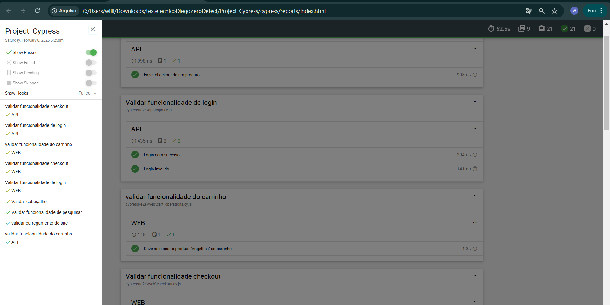

# Automação com Cypress testes Web e Api🚀

Este projeto utiliza **Cypress** para testes automatizados de uma aplicação. Ele foi desenvolvido para validar funcionalidades e assegurar a qualidade do software com testes de interface e validações de fluxo. O projeto inclui relatórios de execução gerados automaticamente, facilitando a análise dos resultados.


## 📋 Índice
- [Tecnologias](#tecnologias)
- [Instalação](#instalação)
- [Uso](#uso)
- [Scripts Disponíveis](#scripts-disponíveis)
- [Relatórios de Testes](#relatórios-de-testes)
- [Estrutura do Código](#estrutura-do-código)
- [Integração Contínua (CI)](#integração-contínua-ci)

### 🛠 Tecnologias
Este projeto utiliza as seguintes tecnologias:
- **Cypress**: v13.15.2 - Framework para automação de testes de interface
- **cypress-mochawesome-reporter**: v3.8.2 - Gerador de relatórios em HTML para execução de testes Cypress
- **Node.js**: Recomenda-se utilizar a versão LTS para compatibilidade
- **npm** ou **yarn**: Gerenciador de pacotes

### ⚙️ Instalação
Para instalar e configurar o projeto, siga os passos abaixo:

1. **Baixe o projeto**:

2. **Instale as dependências**:
   ```bash
   npm install
   ```
   ou
   ```bash
   yarn install
   ```

### 🚀 Uso
Para personalizar a execução dos testes, utilize as variáveis de ambiente e os comandos de configuração no Cypress. Esses recursos são úteis para adaptar o comportamento dos testes conforme o ambiente ou as credenciais de acesso.

### 📜 Scripts Disponíveis
Aqui estão alguns scripts úteis para automação e execução de tarefas do projeto:

- **Executar Cypress em modo de interface**:
  ```bash
  npm run cypress:open
  ```
- **Executar Cypress em modo headless**:
  ```bash
  npm run cypress:run
  ```
- **Gerar relatório Mochawesome**:
  Após executar os testes em modo headless, o relatório será automaticamente gerado na pasta `cypress/reports/mochawesome`.

### 📊 Relatórios de Testes
O Cypress está configurado para gerar relatórios detalhados usando o **cypress-mochawesome-reporter**.

1. **Relatório HTML**:
   Após a execução dos testes, você pode visualizar um relatório detalhado em HTML, acessando o arquivo `mochawesome.html` na pasta `cypress/reports/mochawesome`.

   

2. **Como visualizar o relatório**:
   Abra o arquivo `mochawesome.html` no navegador para obter um resumo gráfico e interativo dos resultados dos testes, incluindo testes bem-sucedidos e falhas, além de capturas de tela e logs detalhados.

### 🗂 Estrutura do Código

Este projeto utiliza os recursos nativos do **Cypress** para organização e estruturação dos testes, o que facilita a manutenção e a reutilização do código. Veja como o projeto está organizado:

- **Fixtures**: Localizados na pasta `fixtures/`, contém arquivos JSON usados para armazenar dados estáticos ou mocks que podem ser reutilizados em diferentes testes, como usuários, mensagens e dados de pagamento.

- **Commands**: Localizados em `support/`, contém comandos customizados do Cypress para encapsular interações repetitivas ou complexas, como adicionar produtos ao carrinho, validar textos e finalizar compras.

- **Env**: Variáveis de ambiente configuradas no `cypress.env.json` permitem o uso dinâmico de valores, como username e password válido, garantindo flexibilidade nos testes.

- **Specs**: Localizadas na pasta `e2e/`, agrupam os testes em contextos, como cadastro, login, e fluxo de carrinho de compras. Cada spec foca em uma área específica da aplicação, com organização clara para facilitar a leitura e manutenção.

### Benefícios da Estrutura
- **Reutilização**: Os comandos customizados encapsulam lógica comum, reduzindo redundâncias.
- **Manutenção Simplificada**: Alterações nos seletores ou fluxos podem ser feitas centralizadamente em comandos ou fixtures.
- **Clareza**: A organização por contextos e uso de dados estruturados facilita a compreensão dos testes.

Essa abordagem mantém o projeto modular e facilita sua escalabilidade, melhorando a eficiência na automação de testes. 🚀

### 🔄 Integração Contínua (CI)

O projeto está configurado para **GitHub Actions** para automação da pipeline de testes. A configuração no arquivo `github/workflows/cypress-tests.yml` permite que os testes Cypress sejam executados em cada push na branch `master`, ao abrir um merge request ou diariamente às 09:00.

**Pipeline de Testes Cypress**:
- **Imagem Docker**: Utiliza a imagem `cypress/base:18.16.0`, pré-configurada com Cypress e Node 18.
- **Estágios**: Definido para rodar no estágio `test`.
- **Scripts**:
  - Instalação de dependências com `npm install`.
  - Execução dos testes Cypress em modo headless com `npx cypress run`.
- **Artifacts**: Após a execução, os relatórios de testes, vídeos e screenshots são salvos e mantidos por 1 semana.
- **Notificação de Erro**: Caso o job falhe, uma notificação é enviada ao Slack com detalhes do commit e link para o job, usando a URL configurada para o webhook.
---

### Agradecimentos 🙏
Obrigado por conferir este projeto! Estou sempre em busca de melhorar e aplicar boas práticas em automação de testes. Além disso, possuo certificações CTFL(Certified Tester Foundation Level) e CT-TAE(Certified Tester - Test Automation Engineer), que validam meu compromisso com a qualidade e a eficácia em testes de software.
